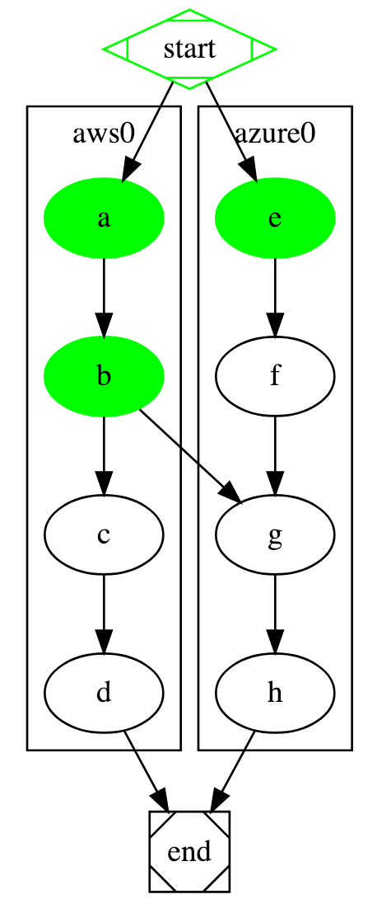

# Infrastructure Workflow (proposed)

Cloudmesh will support an infrastructure workflow in which we specify python functionas and map their execution on cloud
infrastructure. The point hier is not to specify an optimal mapping between resources, but to define `a` mapping. In
future differnt mapping strategies can be pursued.

An example is given below.

```python
from cloudmesh.common.util import HEADING
def a(): HEADING()
def b(): HEADING()
def c(): HEADING()
def d(): HEADING()
def e(): HEADING()
def f(): HEADING()
def g(): HEADING()
def h(): HEADING()
```

Where headig is an internal debugging function that prints out the name of the function so we have some thing to do.

The functions can be specified either with a workflow graph or a parallel language specification 

```
(a; b; c; d) | (e; f; g; h) & (b ; g)
```

or

```
a -> b -> c -> d;
e -> f -> g -> h;
start -> a;
start -> e;
b -> g;
h -> end;
d -> end;
}
```

In addition to the workflow the mapping has to be specified as follows:


A possible graphviz rendering is while also rendering the state of successfully executed functions in green

```
vm["aws0"] = (a, b, c, d) 
vm("azure0"] = (e, f, g, h)
```

To start the vms we canuse the common vm commands (to be completed)

```
cms vm --name=aws0 --cloud=aws
cms vm --name=azure0 --cloud azure
```

Together this specifies 
a sets of functions do be executed on a particular vm hosted on a cloud


A graph to render this is displayed in dot format in the next figure




```
digraph G {

	subgraph cluster_0 {
		a -> b -> c -> d;
		label = "aws0";
	}

	subgraph cluster_1 {
		e -> f -> g -> h;
		label = "azure0";
	}

	start -> a;
	start -> e;
	b -> g;
    h -> end;
    d -> end;
	start [shape=Mdiamond];
	end [shape=Msquare];

	a [style=filled,color=green];
	e [style=filled,color=green];
	b [style=filled,color=green];
	start [color=green]
}

```

## Javascript Interface (proposed)

We are looking for someone that would chose as its project to include a rendering of some DAG in javascript. The
javascript library must be free to use. Nodes and edges must be able to be labeled.

A promissing start for a Javascript library is 
 
* <http://visjs.org/network_examples.html>
* <http://visjs.org/examples/network/events/interactionEvents.html>


This project is only recommended for someone that knows javascript already.

You will do the rest of the project in python. It is important that the functions be specified in python and not just
Javascript. The focus is not on specifying the DAG with a GUI, but to visualizing it at runtime with status updates

Here is another summary that we posted earlier and is probably better as it has a dict return 

So what we want to do is something i have done previously somewhere with graphviz, but instead of using graphviz we use
java script. W want to define tasks that depend on each other. The tasks are defined as python functions. The dependencieas are
specified via a simple graph string

 
```python

 

def a (); print("a"); sleep(1) ; return {"status": "done", "color":"green", shape:"circle", label="a"}

def b (); print("b"); sleep(2); return{"status": "done", "color":"green", shape:"circle", label="b"}

def b (); print("c"); sleep(3); return{"status": "done", "color":"green", shape:"circle", label="c"}

 
w = workflow("a; b | c")

; = sequential

| = parallel


w.run()
```

 

While executing the javascript would change dynamically the state and color after a calculation is completed.
The workflow should also be able to be specified in yaml

Here just one idea:

 
```
tasks:
    task:
      name: a
      parameter:
         x: "int"
         y:: "int"
      calculation: f(x,y) 
      entry:
         color: green
         label: a
         value: x (this is a python variable local to the function
         shape: circle
      return:
         color: green
         label: a
         value: x (this is a python variable local to the function
         shape: circle
```
 
Naturally at one point f(x,y) will be cloud related such as starting a vm and executing a command in teh vm ....

Followup:

We added a value to the return. Values can be any object.

```python
def a():
    x = 10
    return return{"status": "done", "color":"green", shape:"circle", label="c", value=x}
```

## REST 

An OpenAPI specification for this is to be defined.
